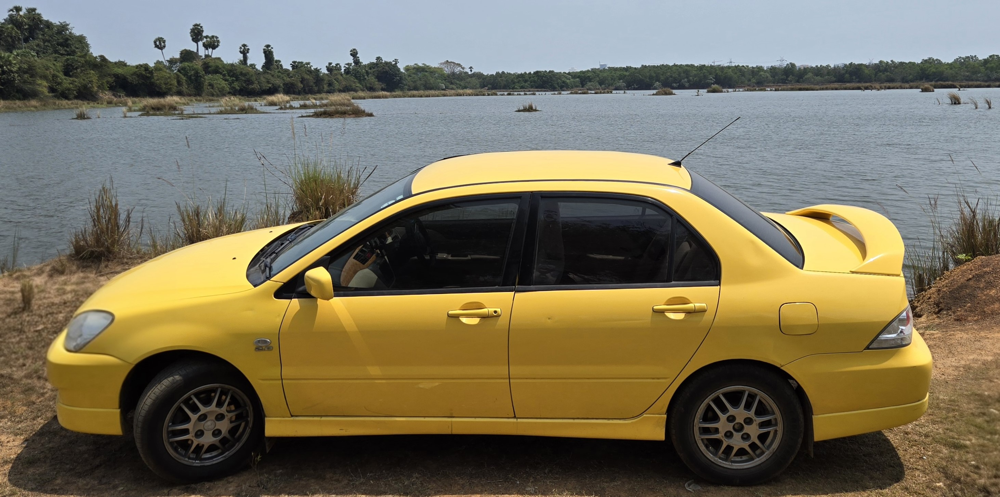

# My Mitsubishi Cedia Sports Turbo Build Journey

> **Planning Phase** - Documenting my upcoming car modification journey in India on a budget

Hey there! I'm a regular guy passionate about cars, and this repository documents my journey of transforming my 2011 Mitsubishi Cedia Sports Rally Edition into a turbocharged daily driver. As someone who's always been interested in building cars, I'm sharing my planning process, parts research, and build approach with fellow car enthusiasts and DIY builders.

## 🏁 Quick Overview

**Vehicle**: 2011 Mitsubishi Cedia Sports Rally Edition
**Engine**: 4G94 2.0L Petrol, Manual Transmission
**Color**: Yellow
**Special Features**: MOMO Steering Wheel, OZ Racing Alloys
**Goal**: 160-200 HP turbocharged street car on a budget
**Location**: India 🇮🇳
**Budget**: ₹3L - ₹4L (INR)
**Timeline**: 6-12 months (currently in planning phase)

## 📺 YouTube Journey

I'm documenting this build on my YouTube channel [@narwalbuilds](https://www.youtube.com/@narwalbuilds). Videos for each phase will be uploaded as the build progresses:

- **Phase 0 Video**: Planning & Research (Coming Soon)
- **Phase 1 Video**: Complete Maintenance (Coming Soon)
- **Phase 2 Video**: Turbo System Build (Coming Soon)
- **Phase 3 Video**: Handling & Control (Coming Soon)
- **Phase 4 Video**: Aesthetics & Final Touches (Coming Soon)

## 📋 Table of Contents

1. [Project Overview](#-project-overview)
2. [Why This Build?](#-why-this-build)
3. [Build Phases](#-build-phases)
4. [File Guide](#-file-guide)
5. [Progress Tracking](#-progress-tracking)

## 🚗 Project Overview

Welcome to my personal build diary for my 2011 Mitsubishi Cedia Sports Rally Edition. This is not just a static guide—it's my evolving to-do list, progress tracker, and a place to dump every lesson, mistake, and win as I go. If you want to follow along, steal my ideas, or just see what goes wrong, you're in the right place.

### About the Car

- **Model:** 2011 Mitsubishi Cedia Sports Rally Edition
- **Engine:** 4G94 2.0L Petrol, Manual
- **Color:** Yellow (because why not?)
- **Goal:** 160–200 HP turbo daily, reliable, fun, and not bankrupting me
- **Location:** India 🇮🇳

### How I Use This Repo

This is my build's "command center."

- **Every file is a living document.**
- **I update status, add notes, and log issues as I go.**
- **All the details (tools, parts, consumables) are in their own files—no repeating!**

**If you're following along:**

- Start here for the big picture and my current status
- Jump to any phase for the latest work items and progress
- For specs, prices, and what to buy, always check [tools.md](tools.md), [consumables.md](consumables.md), and [parts.md](parts.md)

## 🏁 Build Phases

| Phase | What’s Happening    | Status      | Notes                                         |
| ----- | -------------------- | ----------- | --------------------------------------------- |
| 0     | [Planning & Research](phase_0.md)  | ✅ Complete | All research, budget, and sourcing plans here |
| 1     | [Full Maintenance](phase_1.md)     | ⏳ Planned  | Waiting for car to hit the garage             |
| 2     | [Turbo System Build](phase_2.md)   | ⏳ Planned  | Will start after maintenance done             |
| 3     | [Handling & Control](phase_3.md)   | ⏳ Planned  | Suspension, brakes, wheels—after turbo       |
| 4     | [Aesthetics & Details](phase_4.md) | ⏳ Planned  | Paint, interior, final touches                |

**Legend:** ✅ Complete | 🔄 In Progress | ⏳ Planned | ⚠️ On Hold

## 🗂️ File Guide

| File           | What’s Inside                              | How I Use It                |
| -------------- | ------------------------------------------- | --------------------------- |
| [README.md](README.md)      | This overview, my main task list            | Always up to date           |
| [tools.md](tools.md)       | Every tool I use, with details              | Referenced in all phases    |
| [consumables.md](consumables.md) | All fluids, cleaners, adhesives, etc.       | Shopping and planning       |
| [parts.md](parts.md)       | Every part, spec, and price                 | Sourcing and budgeting      |
| [phase_0.md](phase_0.md)     | All planning tasks, research, and decisions | My "brain dump" for phase 0 |
| [phase_1.md](phase_1.md)     | Maintenance work items, status, notes       | Checklist for phase 1       |
| [phase_2.md](phase_2.md)     | Turbo build tasks, status, issues           | Checklist for phase 2       |
| [phase_3.md](phase_3.md)     | Handling/brake tasks, status, issues        | Checklist for phase 3       |
| [phase_4.md](phase_4.md)     | Aesthetics/interior tasks, status, issues   | Checklist for phase 4       |

## 📈 Progress Tracking

### Phase Status Table

| Phase          | Start    | End      | Status | Key Notes                            |
| -------------- | -------- | -------- | ------ | ------------------------------------ |
| [0: Planning](phase_0.md)    | Mar 2026 | Apr 2026 | ✅     | All plans, budget, and research done |
| [1: Maintenance](phase_1.md) | TBA      | TBA      | ⏳     | Waiting for garage slot              |
| [2: Turbo Build](phase_2.md) | TBA      | TBA      | ⏳     | Will start after phase 1             |
| [3: Handling](phase_3.md)    | TBA      | TBA      | ⏳     | After turbo, focus on control        |
| [4: Aesthetics](phase_4.md)  | TBA      | TBA      | ⏳     | Final phase, make it pretty          |

### How I Track Tasks

Every phase file (phase_0.md, phase_1.md, etc.) is a running task list. Each work item has:

- **Task**: What needs to be done
- **Status**: Planned / In Progress / Complete
- **Notes**: What I learned, what went wrong, what to buy, etc.

I update these as I go. If you want to see the real story (including mistakes), check the phase files.

### Where's All the Detail?

- **Tools, parts, and consumables**: See [tools.md](tools.md), [consumables.md](consumables.md), [parts.md](parts.md)
- **Each phase**: Only lists tasks and links to the above for details
- **No repeating info!**

---

## 🎥 YouTube & Social

I’m sharing the whole thing on YouTube: [@narwalbuilds](https://www.youtube.com/@narwalbuilds)

---

## 💡 Why This Format?

- I want a real, honest record of my build
- I hate repeating myself—details live in one place
- I want to see my progress at a glance
- Anyone can fork this and use it for their own build

---

## 🏆 What’s Next?

- [ ] [Phase 1: Maintenance – get the car healthy](phase_1.md)
- [ ] [Phase 2: Turbo install – make it fast (but safe!)](phase_2.md)
- [ ] [Phase 3: Handling – make it stop and turn](phase_3.md)
- [ ] [Phase 4: Aesthetics – make it look and feel awesome](phase_4.md)

---

**This is my build, my mistakes, my wins. If you’re building your own, steal my format, improve it, and let me know how it goes!**

[Planning →](phase_0.md)